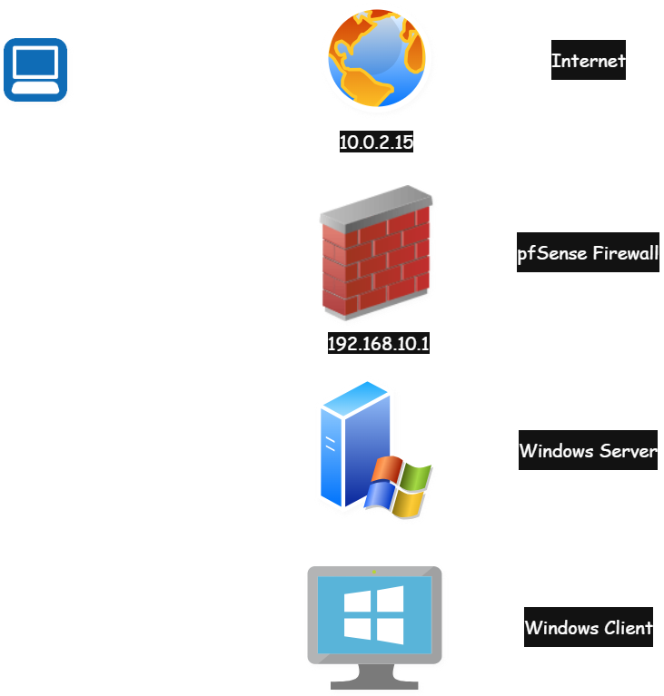
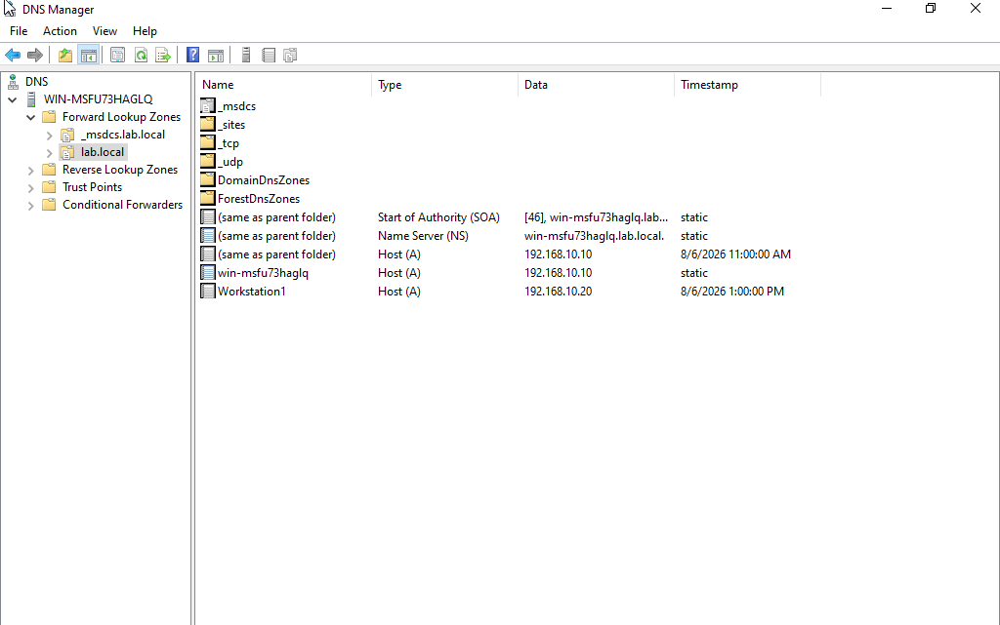
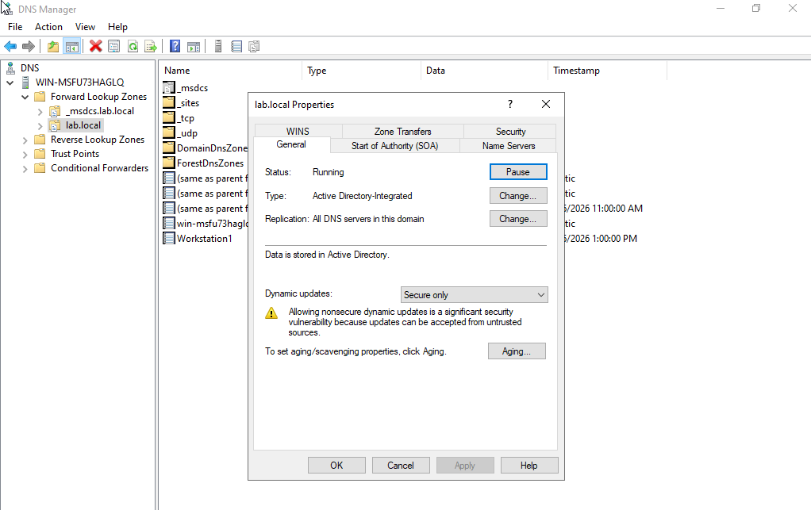
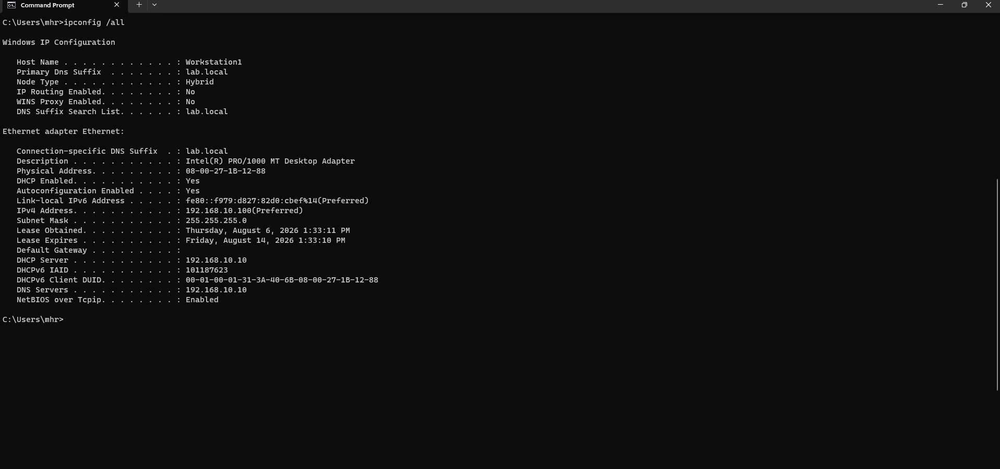
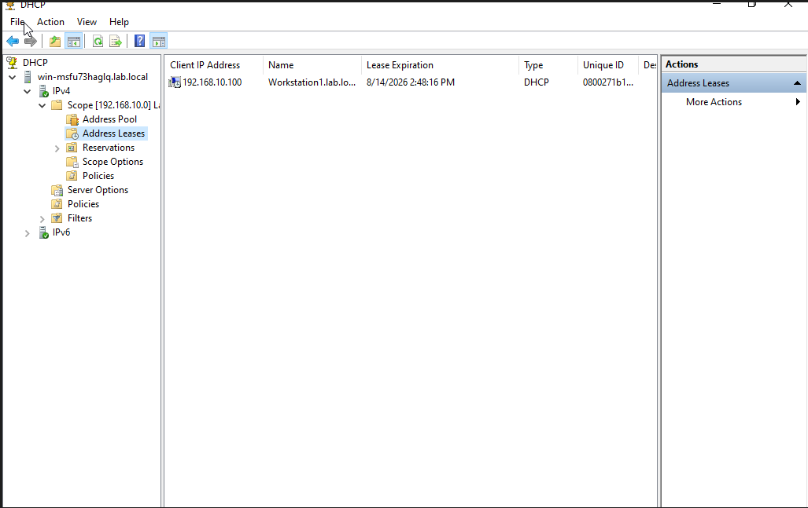
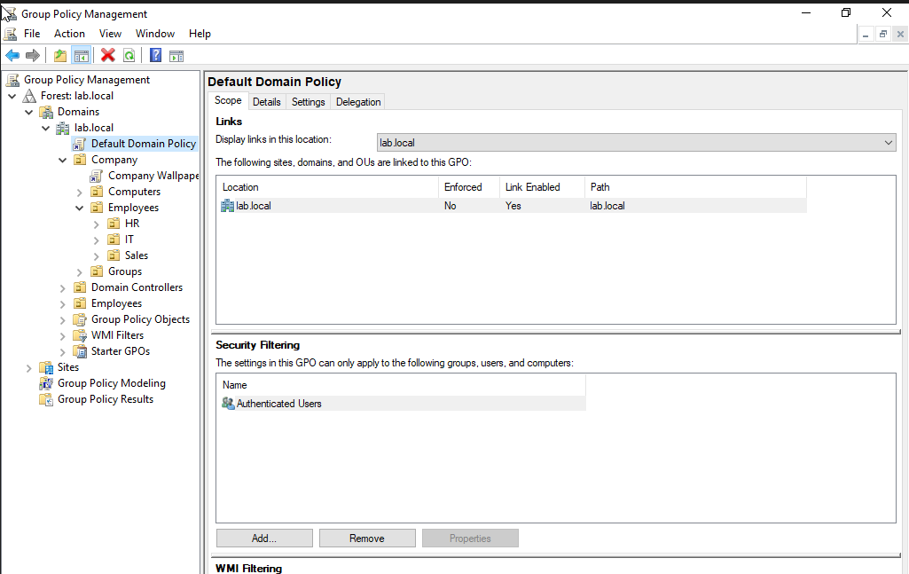
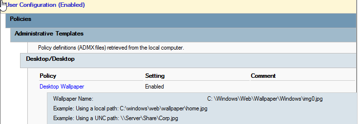
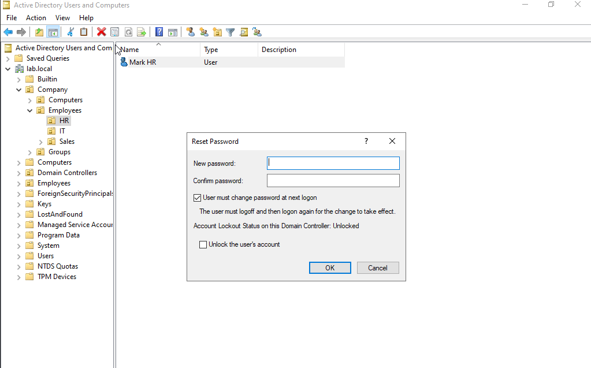
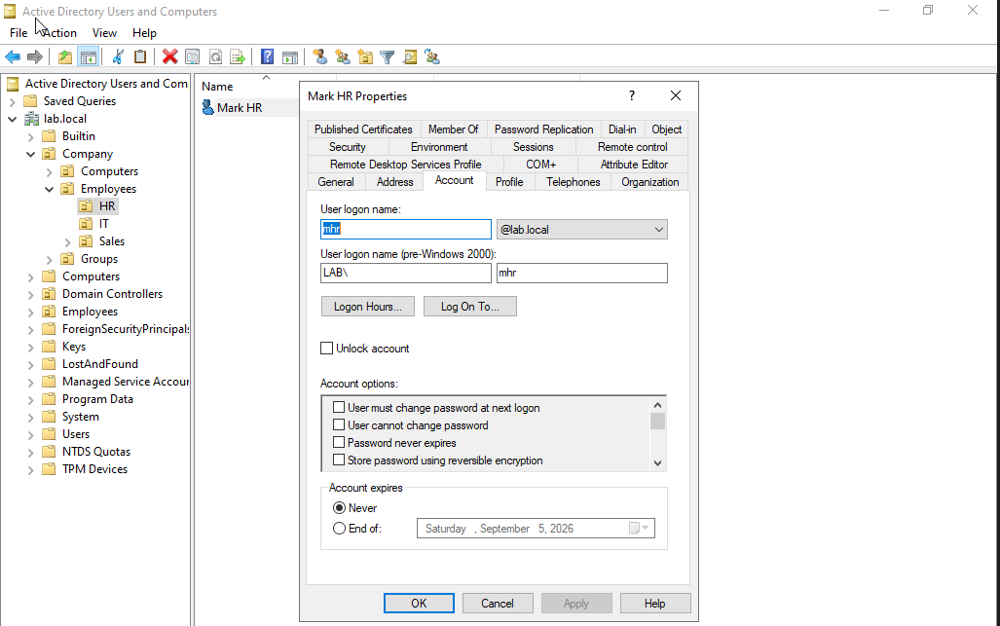
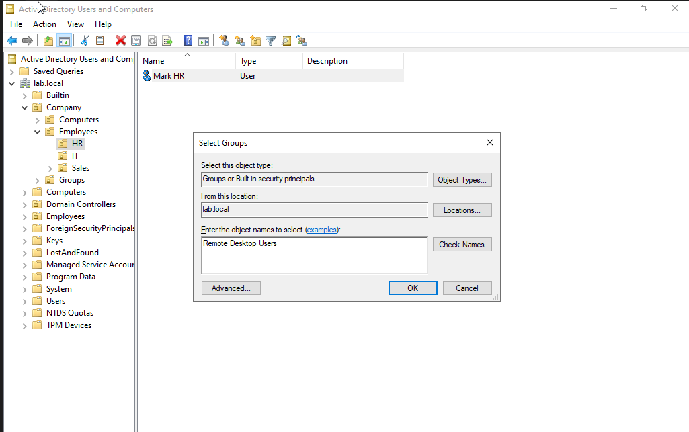

# IT Home Lab

### 📊 At a Glance
- **4** Virtual Machines deployed (Windows Server, Windows 10, Windows 11, pfSense)
- **3** Departments structured in Active Directory (HR, IT, Sales)
- **1** Custom Group Policy Object created and enforced
- **3** Help desk tasks documented (password reset, account unlock, group management)
- **2** Real troubleshooting issues diagnosed and resolved

## 📑 Table of Contents
- [Lab Overview](https://github.com/codyakennon/it-home-lab/tree/main#%EF%B8%8F-lab-overview)
- [Active Directory](https://github.com/codyakennon/it-home-lab#%EF%B8%8F-active-directory)
- [DNS](#-dns)
- [DHCP](#-dhcp)
- [Group Policy](#-group-policy)
- [Help Desk Task Simulation](#-help-desk-task-simulation)
- [Firewall (pfSense) — In Progress](#-firewall-pfsense--in-progress)
- [Challenges & Lessons Learned](#-challenges--lessons-learned)
- [TryHackMe — SOC Level 1](#-tryhackme--soc-level-1)
- [Why I Built This](#-why-i-built-this)

A self-built virtual infrastructure lab created to practice real-world IT support and networking skills — built as I transition from sales into IT and cybersecurity.

## 🖥️ Lab Overview

**Tools:** Oracle VirtualBox, pfSense
**Virtual Machines:**
- Windows Server (Domain Controller — AD DS, DNS, DHCP)
- Windows 10 (domain-joined client)
- Windows 11 (domain-joined client)
- pfSense (firewall/router)

**Network Design:**
- Internal virtual network connecting all lab VMs
- pfSense sits between the lab network and the internet, acting as the firewall/gateway
- Windows Server handles DNS and DHCP for the domain

**Network Topology:**

## 🗂️ Active Directory

Installed and configured Active Directory Domain Services (AD DS) on Windows Server, standing up a functional domain from scratch.

- Promoted server to Domain Controller (domain: lab.local)
- Designed an Organizational Unit (OU) structure to mirror a realistic company: departments (HR, IT, Sales) nested under an Employees OU, alongside separate OUs for Computers and Groups
- Created user accounts and assigned them into the correct department OUs
- Practiced moving objects between OUs, including troubleshooting an "access denied" error caused by the "Protect object from accidental deletion" setting

**OU structure overview:**

**HR department:**

**IT department (includes a help desk user and a service account):**

**Sales department:**

## 🌐 DNS

Configured DNS as part of the Active Directory Domain Services installation, using an Active Directory-integrated zone for centralized, secure name resolution across the domain.

- Forward lookup zone (`lab.local`) automatically populated with SOA, NS, and Host (A) records for the domain controller
- Manually added a Host (A) record for a client workstation (Workstation1) to verify name resolution
- Zone type set to **Active Directory-Integrated**, replicating DNS data across all domain controllers rather than relying on a single standalone server
- Dynamic updates set to **Secure only**, preventing DNS records from being accepted from untrusted or unauthenticated sources — a basic but important security control
- Verified zone transfers are disabled by default, limiting exposure of zone data to unauthorized servers

**DNS zone records:**

**Zone properties (AD-integrated, secure dynamic updates):**

## 📡 DHCP

Installed the DHCP Server role and configured a scope to automatically assign IP addresses to client machines on the domain.

- Installed DHCP Server role and completed post-install authorization in Active Directory
- Created and activated a scope with a defined address range and lease duration
- Configured scope options including DNS server and domain name
- Verified functionality end-to-end: released and renewed a lease on a client workstation, confirming it received a real DHCP-assigned address matching the active lease shown on the server

**Client-side lease confirmation (`ipconfig /all`):**

**Server-side matching lease (Address Leases):**

## 🔒 Group Policy

Created and linked a custom Group Policy Object to enforce a setting across the domain, demonstrating GPO creation, linking, and scope.

- Created **Company Wallpaper** GPO and linked it to the Company OU, applying to all users and computers nested underneath (HR, IT, Sales)
- Configured under User Configuration → Administrative Templates → Desktop, enforcing a specific desktop wallpaper across domain-joined machines
- Verified GPO status as Enabled with correct link scope and security filtering (Authenticated Users)

**GPO linked to OU structure:**

**Enforced wallpaper setting (Settings report):**

## 🎫 Help Desk Task Simulation

Practiced core help desk tasks that come up daily in IT support roles, using Active Directory Users and Computers to manage accounts the same way a Level 1 tech would.

- **Password reset:** Reset a user's password and enforced "User must change password at next logon," following standard security practice for help desk-issued resets
- **Account unlock:** Reviewed and demonstrated the account unlock process via the Account tab, including account lockout status and expiration settings
- **Group membership change:** Added a user to a security group to adjust their access/permissions, simulating a common access-request ticket

**Password reset:**

**Account unlock / account management:**

**Group membership change:**

## 🔥 Firewall (pfSense) — In Progress

Currently building out a pfSense firewall to sit at the edge of the lab network for traffic control and segmentation.

- [x] Installed pfSense in VirtualBox
- [x] Assigned WAN/LAN interfaces
- [x] Configured static LAN IP
- [ ] Access web GUI and complete setup wizard
- [ ] Configure firewall rules
- [ ] Test NAT and traffic filtering

*Screenshots coming soon*
## 🧩 Challenges & Lessons Learned

Real hands-on labs come with real problems. Here are a few I ran into and how I solved them and documented because troubleshooting is the actual job.

**pfSense reinstalled itself after setup**
After completing the pfSense install and rebooting, the VM booted straight back into the installer instead of the installed system. Cause: the installation ISO was still mounted in the virtual optical drive, and VirtualBox's boot order checks the CD/DVD drive before the hard disk, same as a physical PC's BIOS. Fix: ejected the ISO (Devices → Optical Drives → Remove disk) and forced a clean reset, which booted correctly from the virtual hard disk. Lesson: always eject installation media before rebooting a VM out of setup.

**"Access Denied" moving an OU in Active Directory**
While reorganizing my OU structure to nest IT alongside HR and Sales under Employees, Windows refused to move the IT OU and returned an access denied error. Cause: the OU had "Protect object from accidental deletion" enabled by default, which also blocks moves. Fix: enabled Advanced Features in AD Users and Computers, opened the OU's Object tab, and temporarily unchecked the protection setting to complete the move, then re-enabled it afterward as a best practice.

**DHCP scope and firewall LAN subnet mismatch**
After building out a DHCP scope on the domain controller (192.168.10.x), I realized it doesn't match the LAN subnet I'd already configured on the pfSense firewall (192.168.1.1). The two need to be on the same subnet for pfSense to route and firewall traffic for DHCP clients correctly. This is a good example of why network planning matters before configuring individual devices, currently working through resolving this by aligning both to the same subnet.

**Inconsistent OU structure**
Early in building out Active Directory, I had HR and Sales OUs nested under Employees, but two actual user accounts sitting loose directly in Employees instead of inside a department. I caught this while reviewing the structure for documentation and reorganized so every user lives inside a proper department OU (HR, IT, or Sales), making the hierarchy consistent and easier to apply Group Policy and permissions against going forward.

## 🔐 TryHackMe — SOC Level 1

Currently working through TryHackMe's **SOC Level 1** learning path to build foundational security operations skills alongside my infrastructure work.

**Focus areas in progress:**
- Security event monitoring and alert triage
- SIEM fundamentals and log analysis
- Threat intelligence and the MITRE ATT&CK framework
- Incident response workflows
- Phishing analysis and basic malware investigation

*Room completions and writeups will be added here as they're finished.*

[TryHackMe Profile](https://tryhackme.com/p/codyakennon)

## 📌 Why I Built This

I wanted hands-on proof I could actually do the things I was studying for, not just pass exams. This lab is where I break things on purpose, fix them, and document the process the same way I would in a real support role.
