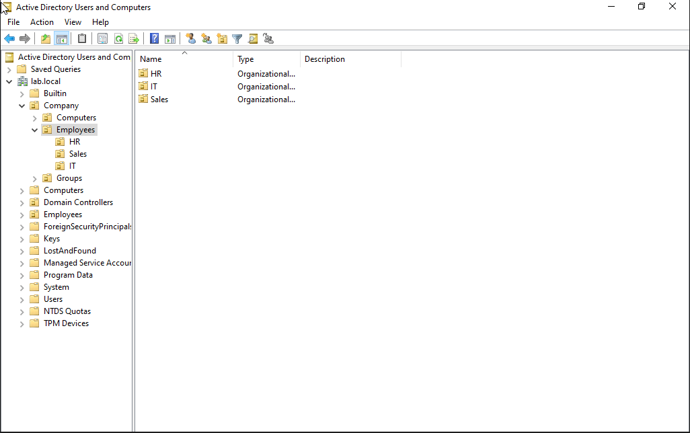

# IT Home Lab

A self-built virtual infrastructure lab created to practice real-world IT support and networking skills — built as I transition from sales into IT and cybersecurity.

## 🖥️ Lab Overview

**Tools:** Oracle VirtualBox, pfSense
**Virtual Machines:**
- Windows Server (Domain Controller — AD DS, DNS, DHCP)
- Windows 10 (domain-joined client)
- Windows 11 (domain-joined client)
- pfSense (firewall/router)

**Network Design:**
- Internal virtual network connecting all lab VMs
- pfSense sits between the lab network and the internet, acting as the firewall/gateway
- Windows Server handles DNS and DHCP for the domain

---

## 🗂️ Active Directory

Installed and configured Active Directory Domain Services (AD DS) on Windows Server, standing up a functional domain from scratch.

- Promoted server to Domain Controller (domain: lab.local)
- Designed an Organizational Unit (OU) structure to mirror a realistic company: departments (HR, IT, Sales) nested under an Employees OU, alongside separate OUs for Computers and Groups
- Created user accounts and assigned them into the correct department OUs
- Practiced moving objects between OUs, including troubleshooting an "access denied" error caused by the "Protect object from accidental deletion" setting

**OU structure overview:**

**HR department:**

**IT department (includes a help desk user and a service account):**

**Sales department:**

---

## 🌐 DNS & DHCP

Configured core network services to support the domain and client devices.

- Set up forward lookup zones and DNS records
- Configured DHCP scope, exclusions, and lease options for client devices
- Verified name resolution and IP assignment across the domain

*Screenshots coming soon*

---

## 🔒 Group Policy

Applied Group Policy Objects (GPOs) to enforce settings across domain-joined machines.

*Screenshots coming soon*

---

## 🔥 Firewall (pfSense) — In Progress

Currently building out a pfSense firewall to sit at the edge of the lab network for traffic control and segmentation.

- [x] Installed pfSense in VirtualBox
- [x] Assigned WAN/LAN interfaces
- [x] Configured static LAN IP
- [ ] Access web GUI and complete setup wizard
- [ ] Configure firewall rules
- [ ] Test NAT and traffic filtering

*Screenshots coming soon*

---

## 📌 Why I Built This

I wanted hands-on proof I could actually do the things I was studying for, not just pass exams. This lab is where I break things on purpose, fix them, and document the process the same way I would in a real support role.
